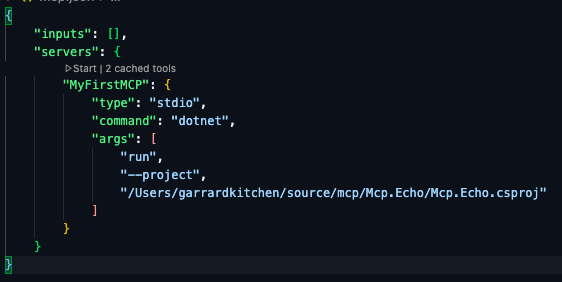
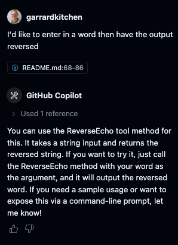
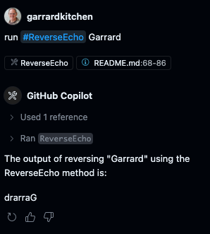

This is my first effort at creating a Model Context Protocol (MCP) server in C#.  I used the reference as a guide and have documented my steps here.

# Model Context Protocol (MCP) Server in C#

This is a simple example of how to create a Model Context Protocol (MCP) server in C#. The MCP server allows you to define tools that can be called from the command line or from other applications.


To start, I entered the following command to create a new console application:

```bash
dotnet new console -n Mcp.Echo  
```

I followed this by adding the following dependencies to my project:

```sh
dotnet add package ModelContextProtocol --prerelease
dotnet add package Microsoft.Extensions.Hosting
```

I pasted the following code into my `Program.cs` file:

```csharp {filename="Program.cs"}
using Microsoft.Extensions.DependencyInjection;
using Microsoft.Extensions.Hosting;
using ModelContextProtocol.Server;
using System.ComponentModel;

var builder = Host.CreateApplicationBuilder(args);
builder.Logging.AddConsole(consoleLogOptions =>
{
    // Configure all logs to go to stderr
    consoleLogOptions.LogToStandardErrorThreshold = LogLevel.Trace;
});

builder.Services
    .AddMcpServer()
    .WithStdioServerTransport()
    .WithToolsFromAssembly();

await builder.Build().RunAsync();
```

I had to add the follow `using` as it was missing:

```csharp
using Microsoft.Extensions.Logging;
```

This is the warning I receivied:

> [!WARNING] 
> ILoggingBuilder' does not contain a definition for 'AddConsole' and no accessible extension method 'AddConsole' accepting a first argument of type 'ILoggingBuilder' could be found (are you missing a using directive or an assembly reference?)

I then created a new file called `EchoTool.cs` and pasted the following code:

```csharp {filename="EchoTool.cs"}
using System.ComponentModel;
using ModelContextProtocol.Server;

[McpServerToolType]
public static class EchoTool
{
    [McpServerTool, Description("Echoes the message back to the client.")]
    public static string Echo(string message) => $"Hello from C#: {message}";

    [McpServerTool, Description("Echoes in reverse the message sent by the client.")]
    public static string ReverseEcho(string message) => new string(message.Reverse().ToArray());
}
```

I then added the file `.vscode/mcp.json' with this content:

```json
{
    "inputs": [],
    "servers": {
        "MyFirstMCP": {
            "type": "stdio",
            "command": "dotnet",
            "args": [
                "run",
                "--project",
                "/Users/garrardkitchen/source/mcp/Mcp.Echo/Mcp.Echo.csproj"
            ]
        }
    }
}
```

You add the server config to the .vscode folder so that it is not shared with other projects.

I then built it to make sure everything was working:

```bash
dotnet build
```

I then either returned to the `mcp.json` file and clicked the `Start` button above `MyFirstMCP` to start the MCP Server.  You can also do this in the Agent view:



The MCP server is now running.

Returning to the Agent view, I entered the following request:



Reacting to what the agent was telling me, I entered:

```sh
run #ReverseEcho Garrard
```



And that's it, my first MCP server in C#!  Spectacular!

Yay me 🤘!

## References

- [Click here](https://devblogs.microsoft.com/dotnet/build-a-model-context-protocol-mcp-server-in-csharp/) to see the original blog post.